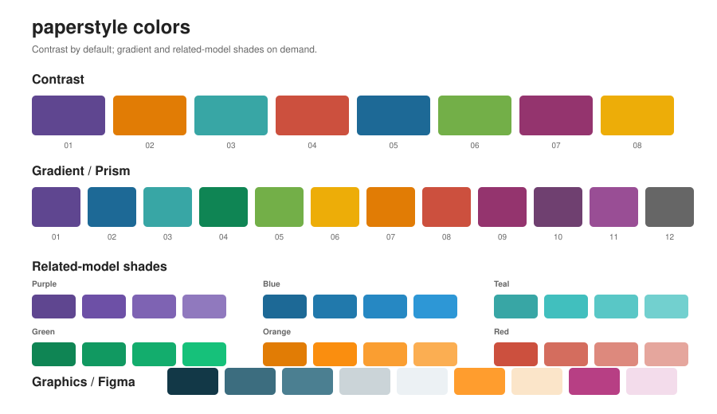
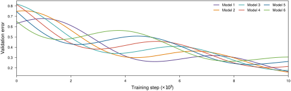
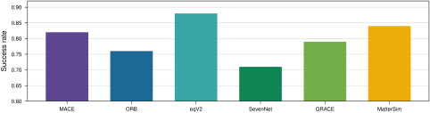
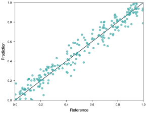
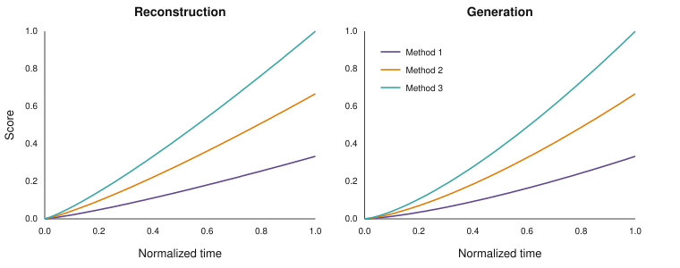

<div align="center">

# paperstyle

**A slightly tuned Matplotlib default for research figures.**

Publication sizing, restrained typography, palettes, and matching Figma color
tokens without replacing Matplotlib's visual language.

</div>

## Install

```bash
uv add git+https://github.com/henk789/paperstyle
```

Pin a release for a paper:

```bash
uv add git+https://github.com/henk789/paperstyle --tag v0.1.0
```

Or with pip:

```bash
pip install git+https://github.com/henk789/paperstyle
```

## Usage

```python
import matplotlib.pyplot as plt
import paperstyle as ps

ps.use()

fig, ax = plt.subplots()
ax.plot(x, y)
```

LaTeX is enabled by default. If a working TeX setup is unavailable, `paperstyle` warns with setup instructions and falls back to Matplotlib text.

| What | Usage |
| --- | --- |
| Default style + contrast palette | `ps.use()` |
| ICLR width | `ps.use("iclr")` |
| Two-column single column | `ps.use("column")` |
| Two-column full width | `ps.use("wide")` |
| Prism/gradient palette | `ps.use(palette="gradient")` |
| Disable TeX | `ps.use(tex=False)` |
| Custom size | `ps.size("iclr", ratio=0.45)` |
| Related colors | `ps.shades(color, 4)` |
| Rounded panel label | `ps.panel_label(ax, "a")` |
| Temporary style | `with ps.context("iclr"):` |

Explicit Matplotlib arguments always win:

```python
ps.use("iclr")
fig, ax = plt.subplots(figsize=(4.2, 2.4))
```

## Look guide

Paperstyle should look like a polished Matplotlib figure, not like a custom
plotting framework. It sets publication sizes, a compact type scale, light line
weights, export defaults, and a useful color cycle. Ordinary axis colors, title
placement, label placement, ticks, and spines remain recognizable Matplotlib
defaults.

Use normal Matplotlib calls such as `set_title`, `set_xlabel`, `set_ylabel`, and
`legend`, and prefer their default placement. Add custom positioning, colored
axis text, or decorative framing only when it communicates something specific
about the data. See the concise [look guide](docs/look-guide.md) for the design
rules used by the examples.

<details>
<summary>TeX setup</summary>

**Ubuntu/Debian**
```bash
sudo apt install texlive-latex-base texlive-latex-extra texlive-fonts-recommended texlive-science dvipng
```

**macOS**
```bash
brew install --cask mactex-no-gui
```

**Windows:** install MiKTeX and enable automatic package installation.

</details>

## Colors

`contrast` is the default for overlapping lines. `gradient` keeps the smooth Prism ordering for bars and categories where position already carries identity.



```python
ps.colors.CONTRAST
ps.colors.GRADIENT
ps.shades(ps.colors.GRADIENT[3], 4)
```

## Examples

### Lines — default contrast palette



<details>
<summary>Code</summary>

```python
import matplotlib.pyplot as plt
import numpy as np
import paperstyle as ps

ps.use()

x = np.linspace(0, 10, 180)
fig, ax = plt.subplots(figsize=ps.size("wide", ratio=0.32))

for i, phase in enumerate(np.linspace(0, 3.5, 6)):
    y = np.exp(-0.12 * x) * (0.63 + 0.16 * np.sin(x + phase)) + 0.022 * phase
    ax.plot(x, y, label=f"Model {i + 1}")

ax.set(xlabel=r"Training step ($\times 10^3$)", ylabel="Validation error")
ax.legend(ncols=3)
```

</details>

### Bars — gradient palette



<details>
<summary>Code</summary>

```python
import matplotlib.pyplot as plt
import paperstyle as ps

ps.use(palette="gradient")

names = ["MACE", "ORB", "eqV2", "SevenNet", "GRACE", "MatterSim"]
values = [0.82, 0.76, 0.88, 0.71, 0.79, 0.84]

fig, ax = plt.subplots(figsize=ps.size("wide", ratio=0.27))
ax.bar(names, values, color=ps.colors.GRADIENT[:len(names)])
ax.grid(axis="y")
```

</details>

### Parity scatter



<details>
<summary>Code</summary>

```python
ps.use()

fig, ax = plt.subplots(figsize=ps.size("default", ratio=0.78))
ax.scatter(
    reference,
    prediction,
    s=12,
    alpha=0.58,
    color=ps.colors.CONTRAST[2],
    rasterized=True,
)
ax.plot([0, 1], [0, 1], color=ps.colors.GREY_DARK, zorder=-10)
```

</details>

### ICLR multi-panel



<details>
<summary>Code</summary>

```python
ps.use("iclr", ncols=2, ratio=0.72)

fig, axes = plt.subplots(1, 2)
fig.subplots_adjust(top=0.84)
for label, ax in zip(("a", "b"), axes):
    ps.panel_label(ax, label)
```

</details>

## Figma

[`figma/paperstyle.tokens.json`](figma/paperstyle.tokens.json) contains the same palettes and graphics colors in Figma's DTCG token format.

In Figma Design:

1. Open **Variables** from the left navigation.
2. Create a collection, e.g. **Paperstyle**.
3. Drag `paperstyle.tokens.json` into the Variables view.

To update later, right-click the existing mode and choose **Import mode**.

## License

MIT. The Prism palette is derived from [CARTOColors](https://github.com/CartoDB/CartoColor), licensed CC BY 4.0.
